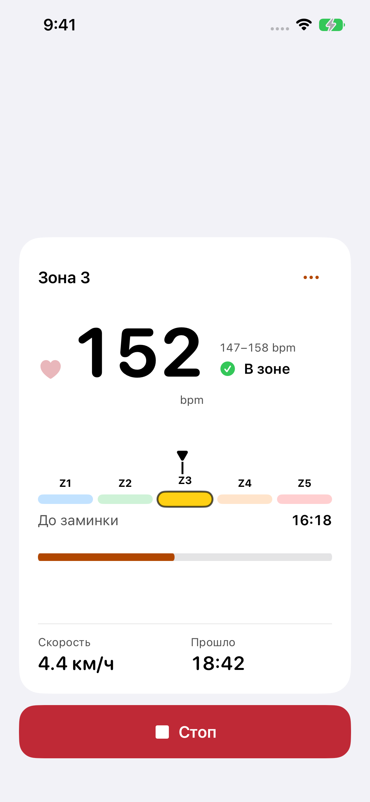

# Focus iteration: semantic state accents

Base commit: `c65c6e71e367f0c53ab03647f08fa451bef570c8`

Branch: `codex/ui-evolution-next`

## Audit findings

1. Training Hub readiness data already carries `Readiness.tint`, but the ready/unavailable mark used the default foreground. Connection and heart-rate state therefore looked alike apart from the text.
2. Active and cooldown presentation already computed a semantic `statusTint` and SF Symbol for below-zone, in-zone, above-zone, unavailable, and cooldown-target states. The `titleOnly` label style hid that symbol, leaving the primary exercise relation text visually neutral.
3. Ending already uses semantic status color, while readiness and active workout did not. State emphasis changed abruptly between adjacent phases of the same Training flow.

## Change

The Hub now applies its existing readiness tint to the check/warning icon. Active and cooldown show their existing status symbol with the existing tint. State text remains primary-colored and unchanged, so wording still carries meaning without color. The unavailable-HR state now uses the standard `exclamationmark.circle.fill` symbol; the prior ECG-slash name did not render in the simulator.

No state mapping, displayed value, action, layout geometry, runtime callback, or observation boundary changed.

## Simulator evidence

All captures use the DEBUG-only Training preview fixtures on the `UI Evolution Preview` iPhone 17e simulator, Xcode 27.0, with synthetic data. The preview launch guard skips `manager.start()` and fixture actions cannot invoke production Start/Stop/extend callbacks. No physical device or treadmill was used.

| State | Appearance | Capture |
| --- | --- | --- |
| Ready | Light | [hub-ready-light.png](hub-ready-light.png) |
| HR unavailable | Light / dark | [light](hub-hr-unavailable-light.png) · [dark](hub-hr-unavailable-dark.png) |
| Below target zone | Light | [active-below-light.png](active-below-light.png) |
| In target zone | Light / dark | [light](active-in-zone-light.png) · [dark](active-in-zone-dark.png) |
| Above target zone | Light | [active-above-light.png](active-above-light.png) |
| HR unavailable during workout | Light / dark | [light](active-no-hr-light.png) · [dark](active-no-hr-dark.png) |
| Cooldown above target | Light | [cooldown-above-light.png](cooldown-above-light.png) |
| Cooldown target reached | Light / dark | [light](cooldown-reached-light.png) · [dark](cooldown-reached-dark.png) |

Visual review confirms that state symbols are visible in both appearances; existing status wording, the large HR value, target range, zone scale, timer, factual speed/time and Stop remain legible. Pixel measurement across the new ready and active captures puts the zone center at `525.1667 pt` and time mark at `586.1667 pt` in both states (`0 pt` shift).

## Verification

- `swift test --package-path ios/WalkingPadRemote/WalkingPadRemote --filter 'HeartRateLegacyBehaviorContractTests|TrainingUIObservationBoundaryTests'` — 27 passed.
- Unsigned iOS Simulator build (`WalkingPadRemote`, `UI Evolution Preview`) — succeeded. Xcode reported existing warnings in unrelated runtime files and skipped AppIntents metadata extraction because the app has no AppIntents dependency.
- `.agents/skills/walkingpad-ios-redesign/scripts/check-ui-scope.sh c65c6e71e367f0c53ab03647f08fa451bef570c8 ios/WalkingPadRemote/WalkingPadRemote/WalkingPadRemote/ContentView.swift` — passed.
- `docs/design/ui-evolution/check-native-anchors.py` — passed on the retained baseline; the same measurement applied to the new ready/active captures also reports zero shift.
- `git diff --check` — passed.

The existing Focus geometry harness was not changed. VoiceOver speech and physical-device behavior were not tested; this is a simulator presentation review only.
